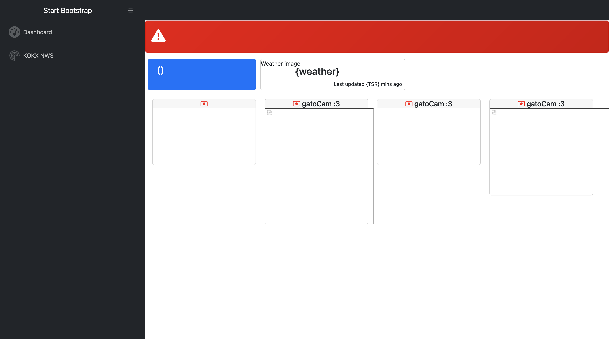
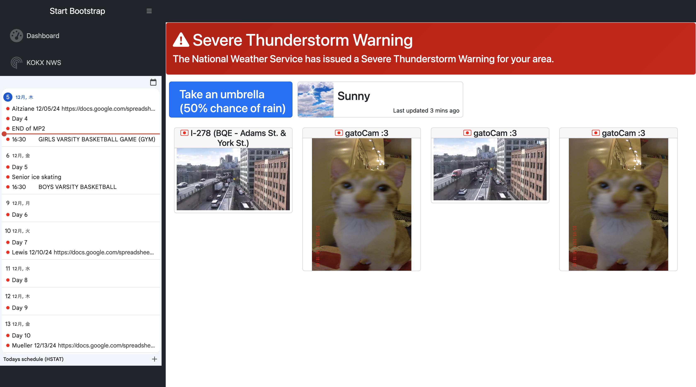

# **11/25/2024** || Entry 1
# Purpose

The purpose of this project is to make my life more easier. Some problems I aim to fix are:
* forgetting important dates
* seeing home visitors at a glance
* weather at a glance

I will be using a mix of different API's (application programming interfaces) and my tool, vue.js. [vue.js](https://vuejs.org/guide/quick-start.html) is a tool that can be used to create placeholders on a website, and update the value in real time. *What?*, you might be asking. If for example, I set a placeholder (vue.js calls it an app) on my website called **clock**, and get a API to send me the actual time right now, the placeholder would update in real time with the actual time.


# Code
To start off, I needed to install vue.js. According to the website, all I needed to do was paste ```<script src="https://unpkg.com/vue@3/dist/vue.global.js"></script>``` into the ```<head>``` tags of any HTML document. And just like that, vue.js is installed.

Now that vue.js is installed, we can tinker around with the [quick start code](https://vuejs.org/guide/quick-start.html#using-vue-from-cdn) generously provided by the developers of vue.js, which is pretty basic. I just changed the names to better fit my purposes on my website.

```html
<div id="app">{{ message } </div> // message is the parameter of the app. You can change all instances of "message" and change it's name.

<script>
  const { createApp } = Vue // this is the name of the placeholder / variable

  createApp({
    data() {
      return {
        message: 'Hello Vue!' // this is the content / text that will be shown anytime "Vue" is called.
      }
    }
  }).mount('#app')
</script>
```

While this makes a rather useless tool right now that just prints "Hello Vue", the possibilities that can now be unlocked with vue.js are limitless. Along with the proper API's, I can turn a ugly website, full of placeholders and missing text, to a beautiful website, chock full of information and not a ugly interface.


### This is what the barebones website looks like before adding APIs (aka a rough draft of what the website will look like before adding camera feeds and connecting the banner to the National Weather Service)



---

### Now, this is after. Forgive the mess right now. The red banner will only come out when the NWS API sends data that will be sent to a Vue app, which will display the text and alert type. With some refactoring (tidying up my code,) I plan on making this website modular. Right now, I made a big mess.




# Challanges
I ended up hardcoding some aspects of the website that make it ugly. For example, the sidebar is not meant to be that wide. That width will only suit my preference. Let's say someone doesn't want the calendar there, and wants more space for the ``` main ``` area of the page (the camera squares). They would have to manually dig up through thousands of lines of code in the ```styles.css``` document, and find the correct settings to change. I had to do it, and it's very difficult and frustrating. So I'll have to find a way to make that easier. 

Another issue is I have problems with the grid system that Bootstrap uses. It seems complicated. but it's really not. Well, except for me. I don't know how to use the grid system very well, but right now, it will fit 4 cards comfortably. But I know some people will want bigger camera feeds, so I need to find a way to make it similar to a drag and drop system, similar to that of one seen on a security camera dashboard. 

[Next Entry](entry02.md)

[SEP11 FP Homepage](../README.md)
